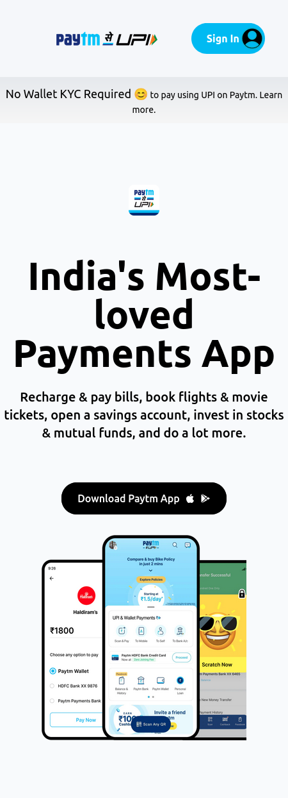

> DISCLAIMER: THIS PAGE WAS MADE AS A PERSONAL EDUCATIONAL PROJECT. This is NOT the official site of the company or brand identified on the page. The creator of this page is NOT affiliated with the company or brand in any way. This page is a personal project made in connection with an educational exercise.

# PROJECT - PAYTM CLONE

This is a clone of paytm website, a tailwind project given by Ineuron.

## Table of contents

- [Overview](#overview)
  - [Screenshot](#screenshot)
  - [Links](#links)
- [My process](#my-process)
  - [Built with](#built-with)
  - [Time required](#time-required)
  - [What I learned](#continues-development)
  - [Useful resources](#useful-resources)
- [Author](#author)
- [Acknowledgments](#acknowledgments)

## Overview

### Screenshot




### Links

- Code File URL: [github.com](https://github.com/Jyotimoykathar/Paytm_Clone)
- Live Site URL: [netlify.app](https://paytm-clone-with-tailwindcss.netlify.app/)

## My process

### Built with

- Semantic HTML5 markup
- Tailwind Css

### Time required

Nearly 4 day required to understand the tailwind doc and apply till completion.

### What I learned

This is the customize color design code snippet using tailwind css.

```js
<script>
      tailwind.config = {
        theme: {
          extend: {
            colors: {
              blueLight: "#00BAF2",
              blueShade: "#00AFE3",
              DblueShade: "#0E3E80",
              blueDark: "#0F4A89",
              lightGrey: "#F5F7FA",
              mediumGrey: "#E6E9ED",
              greyslight: "#F6F6F6",
            },
          },
        },
      };
    </script>
```

### Continued development

I still have a lot to learn about tailwind css library and implement it.
Animation and JS need to be added to make the page more interactive and beautiful.

### Useful resources

- [TAILWIND](https://tailwindcss.com/docs/installation) - This tailwind doc. was very helpful while creating the entire project.
- [ION ICONS](https://ionic.io/ionicons) - This is an amazing website with open source icons that helps to add icons easily to your webpages.

## Author

- Github page- [Jyotimoykathar](https://github.com/Jyotimoykathar/)

## Acknowledgments

Special Thanks to Ineuron team for the Project to learn and improve my Tailwind css framework skills .
